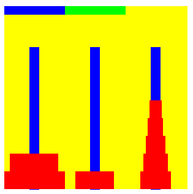

Towers Of Hanoi(A Java applet)
==============================

(Please note:- You would need the latest JRE to play this game) 
---------------------------------------------------------------

The Tower of Hanoi or Towers of Hanoi, is also called the Tower of Brahma or Towers of Brahma, is a mathematical game or puzzle. It consists of three rods, and a number of disks of different sizes which can slide onto a rod. The puzzle starts with the disks in a neat stack in ascending order of a size on one rod, the smallest at the top, thus making a conical shape. The objective of the puzzle is to move the entire stack to another rod, obeying the following rules:
Only one disk may be moved at a time. 

Each move consists of taking the upper disk from one of the rods and sliding it onto another rod, on top of the other disks that may be present on that rod. 
No disk may be placed on top of a smaller disk.

In order to move a disk between poles, click on the pole where the disk is and then click on the pole where you want the disk to move. Try to move the entire stack to another pole in fewer moves.

TOH is written by, Sohail Qayum Malik

